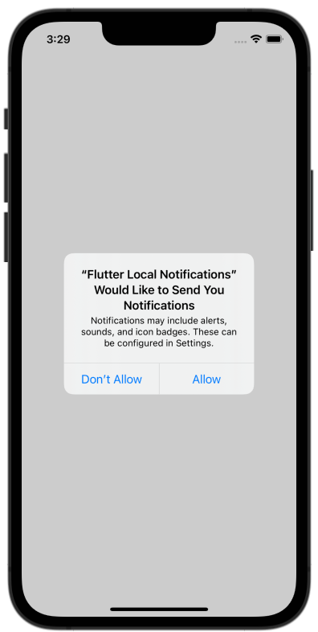
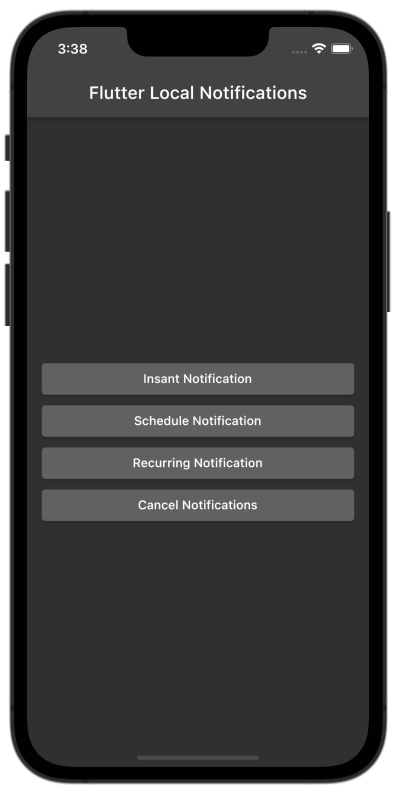
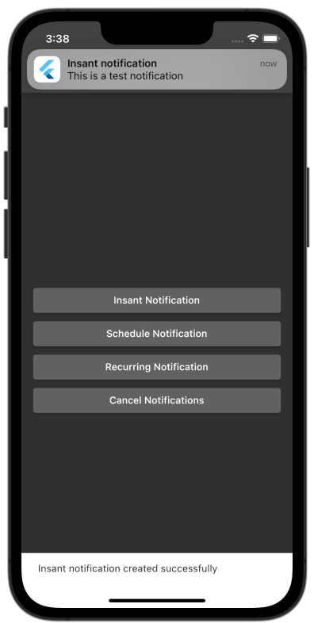
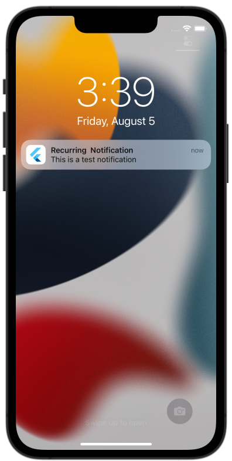

# Flutter Local Notifications

This project shows how to implement local notifications into Android and iOS using [flutter_local_noifications](https://pub.dev/packages/flutter_local_notifications) package.

This project shows 

- How to setup platform-specific notification initialization settings.
- How to display an instant notification.
- How to schedule a notification and a recurring notification.
- How to cancel all notifications.

    
    
    
    

